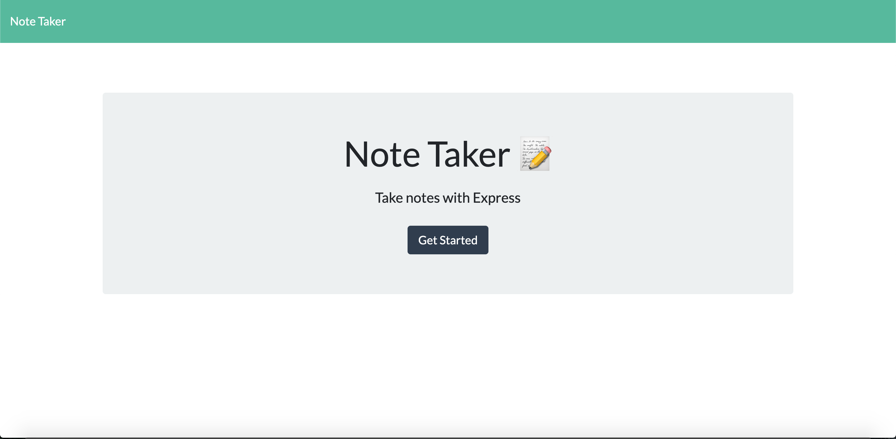
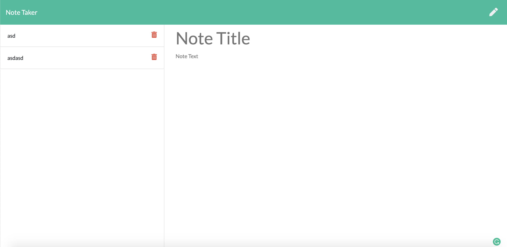

# Note Taker

## Table of Contents
* [Description](#Description)
* [Installation](#Installation)
* [Usage](#Usage)
* [Licnese](#Licnese)
* [Contribution](#Contribution)
* [Test](#Test)
* [Questions](#Questions)

## Description
Making Note pad to write down something that you wanted and also can do save it or delete it.

## Installation
Npm install

## Usage
* This is the home page and you can go to the Note page with clicking "Get Start" button

There is a delete button to get rid of the data.

## Licnese 

## Contribution
Myself

## Test
node server.js

## Questions 
Github profile : https://github.com/Nakwonyoon

[Anytime] Email : yoonnw1000@gmail.com
